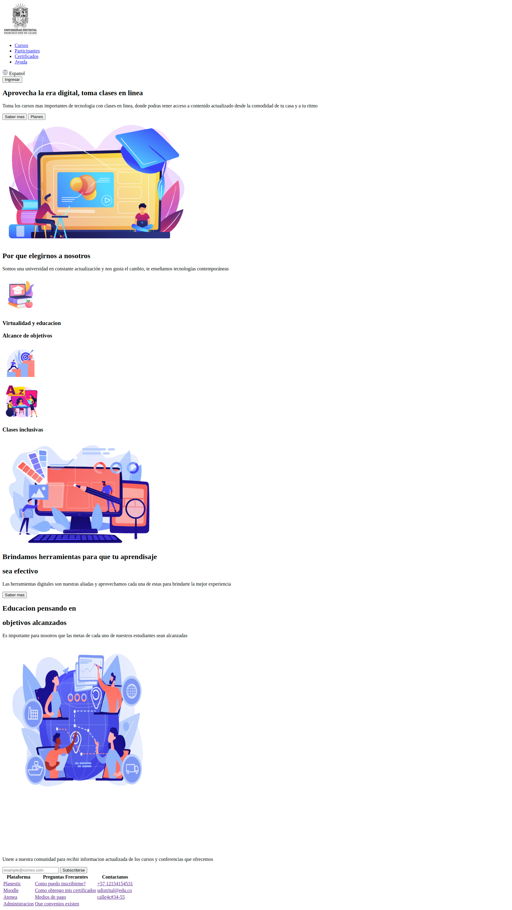
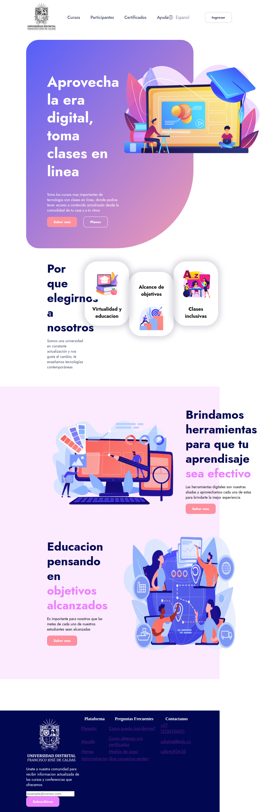
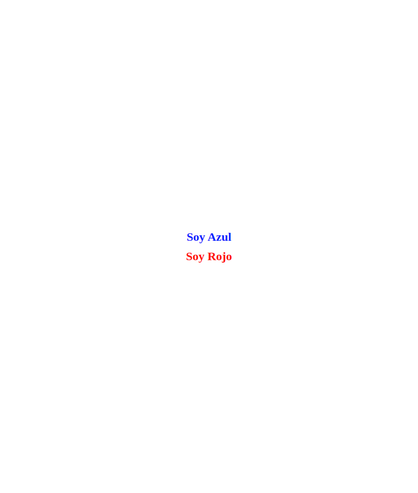

<h1>Taller 9 - Andres Felipe Torres Lopez</h1>

<h2>Informacion</h2>

Curso: Full Stack Basico - Grupo 1

Profesor: Cristian Patino

<h2>Link de la pagina web</h2>
<a href="https://totenkopf1995.github.io/taller-9-full-stack/">Link de Pagina web</a>

<h2>Punto 1: Link de figma</h2>
<a href="https://www.figma.com/file/jZoA7PlB7TLFe9SSNEW7oC/Andres-Felipe-Torres-Lopez?type=design&node-id=0%3A1&mode=design&t=LXCnThIMDbJbvKsY-1">Link de Figma</a>

<h2>Punto 2: Diseno en html</h2>

<h2>Punto 3: Diseno en CSS</h2>

<h2>Punto 4: Titutlos</h2>

<h2>Punto 5: Parrafo</h2>

<h2>Punto 6: Links</h2>

<h2>Punto 7 y 8: Navegacion</h2>

<h2>Punto 9: Tabla</h2>